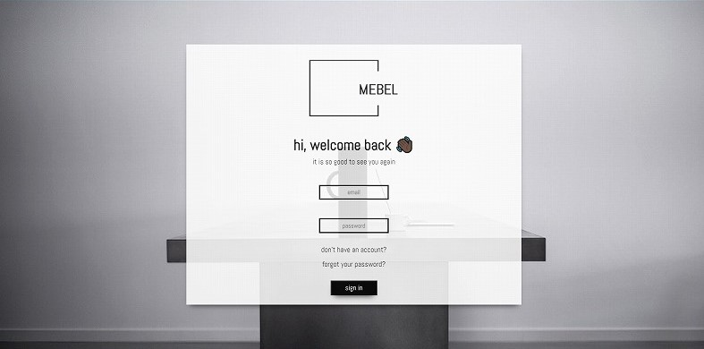
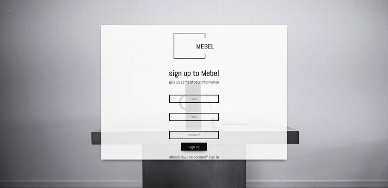
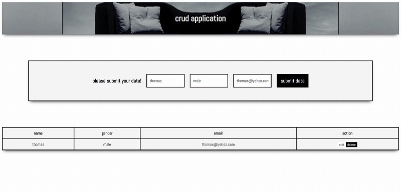

## Login/Register Assignment

this assignment needs us to make a login and register page, with HTML, CSS, and JavaScript. Also need to implement CRUD as well as the model of the database.
I choose to use my previous project assignment, which is "mebel" as the theme of this assignment.

## Links

- Website: [rioyulinanda](https://w1-my-personal-website-rioyulinanda.netlify.app/)
- LinkedIn: [rioyulinanda](https://id.linkedin.com/in/rio-y-kurniawan-55293172)
- GitHub: [rioyulinanda](https://github.com/rioyulinanda)
